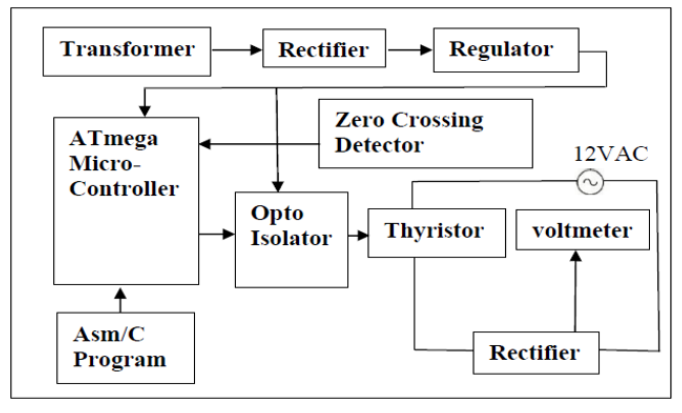
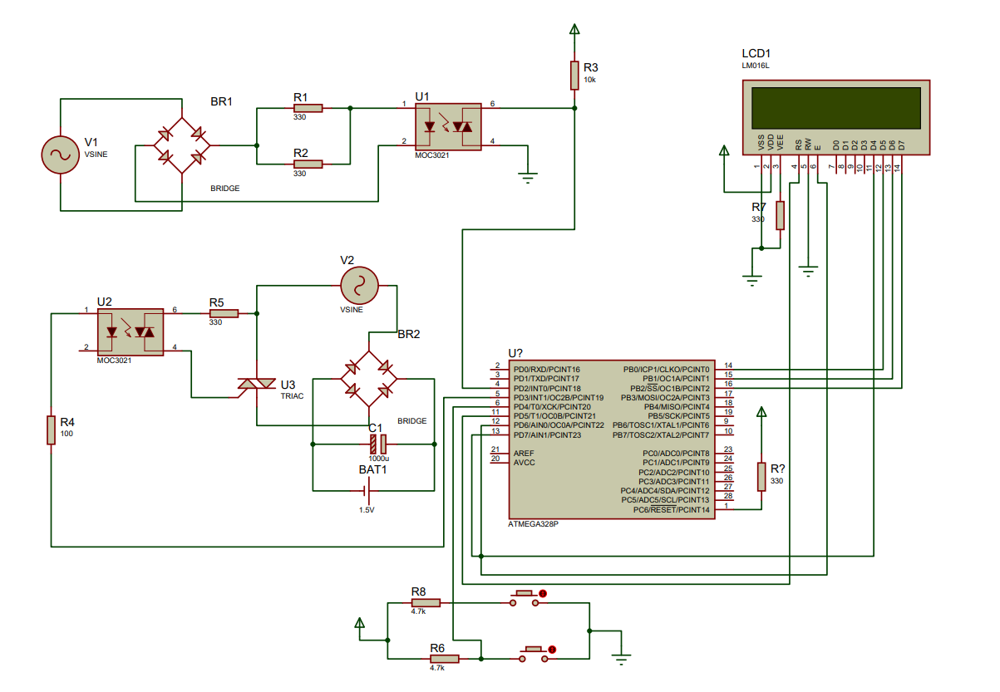

# Thyristor Firing Angle Control for Battery Charging

## Overview
This repository contains the documentation and resources for our project on Thyristor Firing Angle Control for Battery Charging. The project is designed to provide an emergency battery charging solution using a thyristor-controlled rectifier system. It includes circuit diagrams, project reports, and final output images.

## Table of Contents
- [Introduction](#introduction)
- [Objectives](#objectives)
- [Block Diagram](#block-diagram)
- [Advantages & Applications](#advantages--applications)
- [Conclusion](#conclusion)
- [Project Resources](#project-resources)
  - [Circuit Diagram](#circuit-diagram)
  - [Final Output Images](#final-output-images)
  - [Project Report](#project-report)
  - [Presentation](#presentation)
- [License](LICENSE)

## Introduction
The project aims to create an industrial battery charger using a thyristor for controlling the flow of current. It involves detecting the zero-crossing point of the waveform, providing delay in triggering control to a TRIAC through a microcontroller, and supplying power to the load via TRIAC and a linked rectifier.

## Objectives
- Supplying the load and charging the primary battery in case of main battery failure.
- Achieving an overall system efficiency ≥ 80%.
- Obtaining a regulated output of 110V DC with output regulation ≤ 2.5%.

## Block Diagram

## Advantages & Applications
- Elimination of the need for different chargers for various battery voltages.
- Reduction in the production of chargers, minimizing e-waste.
- Industrial applications, solar energy systems, inverters, vehicles, and UPS.

## Conclusion
The emergency battery charger, connected in parallel to the main battery charger, uses DSP-controlled firing circuits for improved efficiency, accuracy, and reliability compared to analog firing circuit-based chargers.

## Project Resources

### Circuit Diagram

### Final Output Images

### Project Report
[Download Project Report](documents/project_report.pdf)

### Presentation
[View Project Presentation](documents/project_presentation.pdf)

